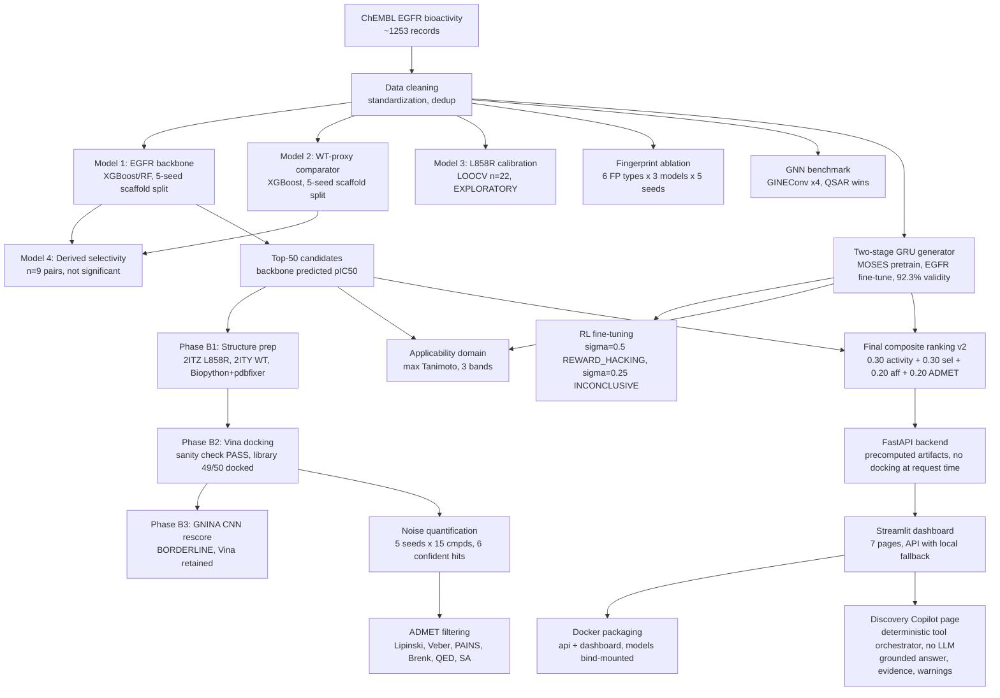
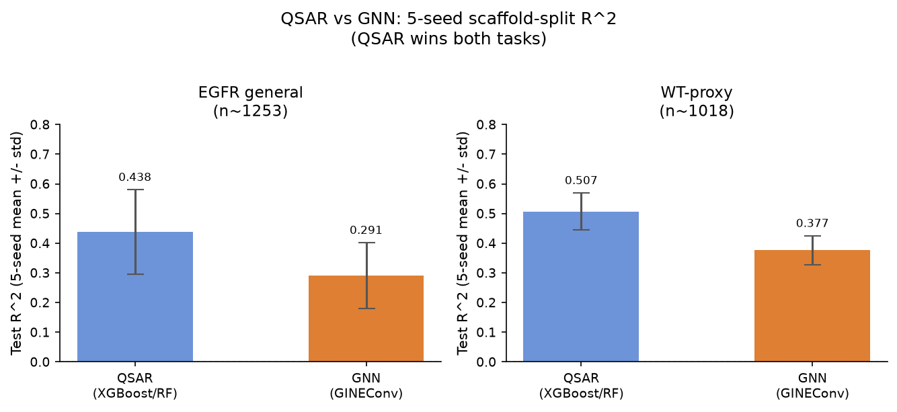
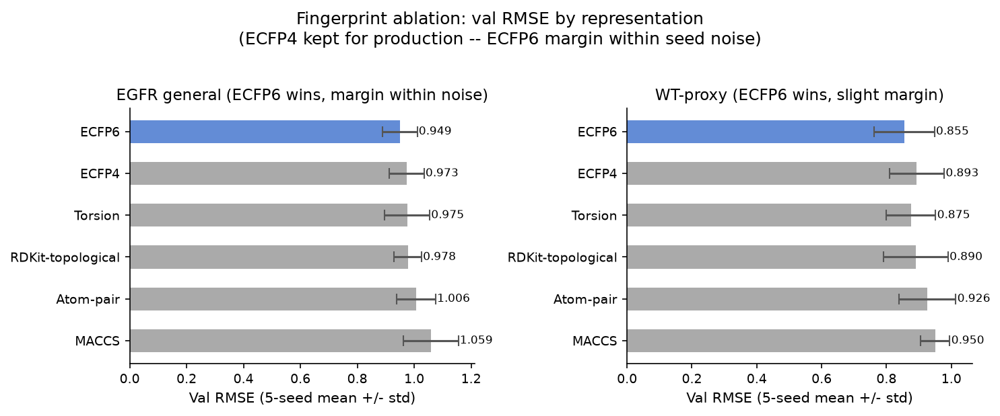
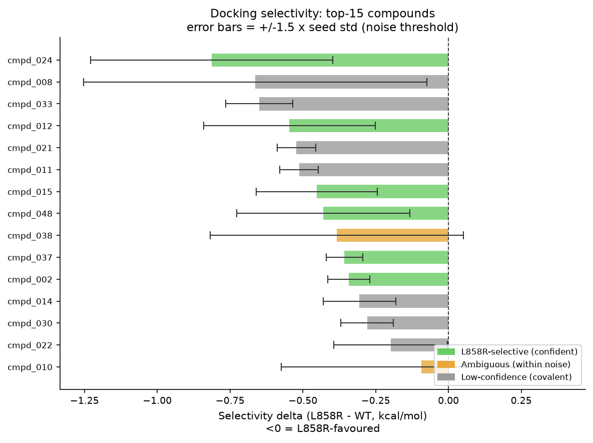
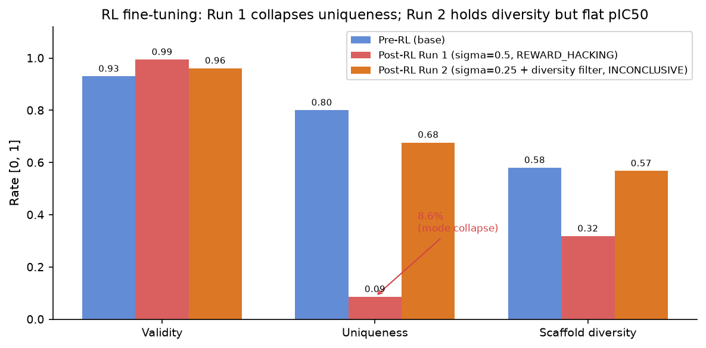
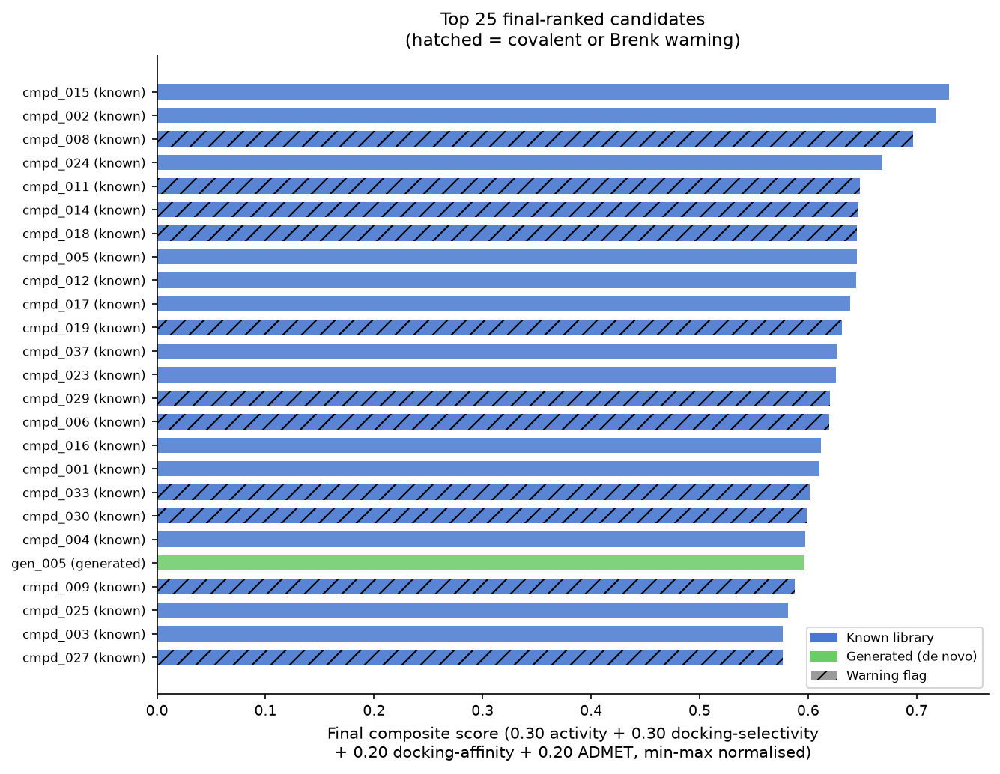
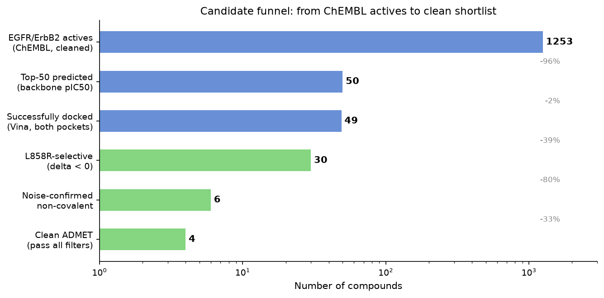

# EGFR L858R Drug Discovery

[](https://github.com/hani-rahmoune/egfr-l858r-discovery/actions/workflows/ci.yml)

Mutation-aware computational pipeline for prioritising EGFR inhibitor candidates selective for the
L858R NSCLC mutation. **EXPLORATORY throughout, not a validated drug-discovery platform.**
Every number here is a computational hypothesis built against a small, real-world labelled dataset
(22 L858R records, 9 paired selectivity measurements), and the negative results are reported as
prominently as the positive ones.

---

## Pipeline architecture



---

## Results

### 1. QSAR model performance

Primary activity models are trained on ~1253 EGFR records (backbone) and ~1018 WT-proxy records,
using Bemis-Murcko scaffold splitting to prevent chemical leakage between train and test. Metrics
are 5-seed averages to account for scaffold partition variance.



**Takeaway:** At ~1k molecules, gradient-boosted trees on fingerprints (QSAR) outperform the
GINEConv GNN on both tasks. The GNN has lower variance but worse accuracy on every metric.
The literature expectation, GNNs need >10k molecules to compete with fingerprint-based models,
is confirmed. Production models remain RandomForest (backbone) and XGBoost (WT-proxy).

| Model | Task | RMSE mean +/- std | R^2 mean +/- std | Pearson/Spearman r |
|---|---|---|---|---|
| QSAR (XGBoost/RF) | EGFR general | 1.010 +/- 0.167 | 0.438 +/- 0.143 | 0.672 +/- 0.105 (Pearson) |
| QSAR (XGBoost/RF) | WT-proxy | 0.942 +/- 0.061 | 0.507 +/- 0.063 | 0.717 +/- 0.047 (Pearson) |
| GNN (GINEConv x4) | EGFR general | 1.130 +/- 0.067 | 0.291 +/- 0.112 | 0.571 +/- 0.075 (Spearman) |
| GNN (GINEConv x4) | WT-proxy | 1.061 +/- 0.052 | 0.377 +/- 0.049 | 0.659 +/- 0.027 (Spearman) |

The high R^2 variance on Model 1 (general, +/-0.143) is structural: scaffold splits at certain
seeds place structurally unusual test compounds that both models were not exposed to. The reliable
estimate for the WT-proxy R^2 is 0.507 +/- 0.063; the single-seed value of 0.604 is at the upper
end of this range.

Feature vector: Morgan ECFP4 2048 bits + 11 RDKit descriptors = 2059 features total.

### 2. Fingerprint ablation

Six fingerprint representations were compared across both tasks (5 seeds each, best of RF/XGB/LGB
per representation).



**Takeaway:** ECFP6 wins by validation RMSE on both tasks, but the margin over ECFP4 falls within
seed noise on the general task (0.024 val RMSE, +/-0.18 test std). ECFP4 is kept for production,
which avoids rebuilding all downstream artifacts. MACCS (167 bits) is consistently weakest, too
coarse for pIC50 regression on kinase inhibitors.

### 3. L858R calibration (EXPLORATORY, n=22)

In LOOCV over 22 labelled L858R records, mean-shift and ridge calibrators do not improve on the
general backbone. Backbone Spearman r 0.620 +/- 0.008 vs calibrators 0.599/0.593.

**Negative result:** L858R-specific signal is not separable at n=22. Use the general backbone for
L858R activity predictions. All L858R-specific model outputs are exploratory.

### 4. Selectivity modelling (EXPLORATORY, n=9)

Derived selectivity (backbone pIC50 minus WT-proxy pIC50) on 9 paired molecules:
Spearman r=0.433, p=0.244. Not statistically significant.

**Negative result:** Selectivity cannot be modelled at n=9. Structure-based methods (docking, FEP)
are the path forward. The 9 deltas are reference data, not a model.

### 5. Docking selectivity

AutoDock Vina 1.2.7 was run against both L858R (2ITZ, Yun et al. 2007) and WT (2ITY, same
construct). Selectivity delta = L858R_score - WT_score in kcal/mol; negative means L858R-favoured.
Error bars are +/-1.5 x seed standard deviation (the noise threshold for a confident call).



**Sanity check (PASS):** All three clinically validated inhibitors favour the L858R pocket.

| Compound | L858R | WT | delta |
|---|---|---|---|
| Gefitinib | -7.860 | -7.492 | -0.368 |
| Erlotinib | -7.666 | -7.263 | -0.403 |
| Osimertinib | -7.944 | -7.306 | -0.638 |

From the 15-compound noise study: 6 non-covalent compounds clear the 1.5 x std noise threshold.
4 of those also pass all ADMET filters (Lipinski, Veber, PAINS, Brenk, QED): **cmpd_015,
cmpd_012, cmpd_037, cmpd_002**. These are the highest-priority candidates.

Rigid-receptor Vina underestimates the expected ~1.7 kcal/mol gefitinib affinity difference
(Yun et al. 2007 reports ~20-fold tighter binding) to ~0.4 kcal/mol. Direction is correct,
magnitude is not quantitatively reliable.

GNINA v1.0 CNN rescoring (Phase B3) is BORDERLINE: 2/3 sanity-check inhibitors pass the
direction criterion. CNN rescoring is not used for library scoring.

### 6. De novo generation and RL fine-tuning

A char-level GRU (hidden 512 x 3 layers) was pretrained on 80k drug-like SMILES from MOSES,
then fine-tuned on 1347 EGFR/ErbB2 actives. Validity improved from 56.3% (single-corpus only)
to 92.3% at temperature 0.8, clearing the 90% goal. 341 distinct Bemis-Murcko scaffolds, 37.5%
absent from the EGFR training set.



**Key finding:** RL fine-tuning (REINVENT augmented-NLL) is either hacking or stalling at this
corpus size. Run 1 (sigma=0.5, no diversity filter) achieved pIC50 gains by collapsing to ~14
scaffolds, uniqueness dropped from 80% to 8.6%. Run 2 (sigma=0.25 + scaffold-memory diversity
filter) held diversity but produced a flat pIC50 change (+0.004 over 50 steps). The production
generator remains `egfr_finetuned_gru.pt`. Do not use `rl_finetuned_gru.pt`.

### 7. Final integrated ranking

All 49 docked known-library candidates and 19 docked generated candidates were ranked with a v2
composite formula: 0.30 x activity + 0.30 x docking-selectivity + 0.20 x docking-affinity + 0.20
x ADMET (QED), each min-max normalised, multiplied by the applicability-domain confidence factor.
Covalent warheads and within-noise selectivity are surfaced as warnings, not silent score penalties.



The top-5 non-covalent known hits (cmpd_015, cmpd_002, cmpd_024, cmpd_012, cmpd_037) converge
with the docking-noise and ADMET shortlist. Best generated candidate **gen_005** ranks #21
(`COc1cc2ncnc(Nc3cccc(Cl)c3F)c2cc1OC`, a methoxy-quinazoline, predicted pIC50 8.10, L858R
delta -0.43 kcal/mol, QED 0.78, in-domain, no warnings). Generated molecules are credible and
drug-like but do not displace the best known actives on an activity-weighted score; their main
value is structural novelty.

### 8. Candidate funnel



From 1253 ChEMBL actives to 4 clean candidates with independent computational evidence across
activity prediction, docking selectivity noise analysis, and ADMET filtering.

---

## Tech stack and specs

| Layer | Technology |
|---|---|
| Chemistry | RDKit, Biopython |
| ML | scikit-learn (RandomForest), XGBoost, LightGBM |
| GNN | PyTorch 2.x, PyTorch Geometric (GINEConv) |
| Generation | PyTorch GRU (char-level), REINVENT RL |
| Docking | AutoDock Vina 1.2.7 (pre-built binary), GNINA 1.0 (WSL2 CPU) |
| Experiment tracking | MLflow (experiment: EGFR_QSAR_benchmark) |
| API | FastAPI + uvicorn |
| Dashboard | Streamlit + Altair |
| Packaging | Docker + docker-compose (python:3.12-slim) |
| Tests | pytest, 773 tests, `@unit` and `@integration` markers |
| Lint | ruff, black |
| Python | 3.12 |

**Data sizes:** EGFR backbone ~1253 records, WT-proxy ~1018 records, L858R labelled 22 records
(after fuzzy assay re-scan fixing 3 mislabelled wild-type assays), paired selectivity 9 molecule
pairs. T790M bucket in the raw data contains 130/211 compound mutants (92 L858R/T790M, 38
L858R/T790M/C797S); only 81 are genuine T790M single-mutant, relevant for a future Model 4.

---

## Quick start (Docker)

Requires Docker Desktop and pre-built model artifacts on disk.

```bash
docker compose up --build
# API:       http://localhost:8000  (docs at /docs)
# Dashboard: http://localhost:8501
docker compose down
```

The dashboard connects to the API automatically. If the API is still loading, the dashboard falls
back to scoring locally. You will see a backend-mode indicator in the sidebar.

Build the required artifacts first if you do not have them:

```bash
PYTHONPATH=. .venv/Scripts/python.exe scripts/clean_bioactivity_data.py
PYTHONPATH=. .venv/Scripts/python.exe scripts/build_egfr_dataset.py
PYTHONPATH=. .venv/Scripts/python.exe scripts/compute_features.py
PYTHONPATH=. .venv/Scripts/python.exe scripts/assign_splits.py
PYTHONPATH=. .venv/Scripts/python.exe scripts/train_models.py
```

## API usage

```bash
# Single molecule fast screen
curl -X POST http://localhost:8000/predict \
  -H "Content-Type: application/json" \
  -d '{"smiles": "COc1cc2ncnc(Nc3ccc(F)c(Cl)c3)c2cc1OCCCN1CCOCC1"}'

# Batch (up to 512 SMILES)
curl -X POST http://localhost:8000/batch_predict \
  -H "Content-Type: application/json" \
  -d '{"smiles_list": ["...smiles1...", "...smiles2..."]}'

# Model info, algorithms, and caveats
curl http://localhost:8000/model-info
```

Response fields: `pic50_mutant` (backbone, Model 1), `pic50_wt` (WT-proxy, Model 2),
`selectivity_proxy` (pIC50 difference, labelled exploratory), `covalent` + `warheads`,
`admet` (status, QED, SA, alerts), `applicability_domain` (band + confidence factor),
`warnings[]`, and `docking_selectivity_available` (always false, docking is offline only).

## Running locally without Docker

```bash
pip install -r requirements/base.txt
pip install -r requirements/ml.txt    # XGBoost, LightGBM, MLflow, Optuna
pip install -r requirements/gnn.txt   # PyTorch, PyG, MLflow

PYTHONPATH=. .venv/Scripts/python.exe -m pytest                    # all 773 tests
PYTHONPATH=. .venv/Scripts/python.exe -m pytest -m unit            # fast, no training
PYTHONPATH=. .venv/Scripts/python.exe -m uvicorn src.api.main:app --reload
PYTHONPATH=. .venv/Scripts/python.exe -m streamlit run src/dashboard/app.py
```

## Discovery Copilot

The seventh dashboard page (`src/dashboard/copilot_page.py`) is a chat interface backed by
`src/agent/`, a deterministic orchestration layer with no LLM dependency and no API key required.
It routes natural-language queries to six precomputed tools: predict a molecule, batch predict,
look up the final ranking, look up docking results, compare candidates, and generate a candidate
report. Three display panels per response:

- **Grounded answer**: the tool output formatted as readable markdown
- **Evidence**: which tool functions were called and what they returned, making the reasoning
  auditable
- **Warnings**: guardrail caveats, including labels that mark ML selectivity as "ML proxy,
  exploratory" and docking deltas as "structure-based (docking)"

Guardrails refuse to assert experimental claims ("is active", "is selective", "validated") unless
the phrase is preceded by a negation. No API key is required. No LLM is called in v1.

See [docs/AGENT.md](docs/AGENT.md) for the full module reference and wiring instructions.

---

## Detailed walkthrough and limitations

Full modeling strategy, data pipeline, docking setup, generation phases, evaluation results,
and the complete negative-result log are in [docs/PROJECT_WALKTHROUGH.md](docs/PROJECT_WALKTHROUGH.md).

The Limitations page in the dashboard (`http://localhost:8501`) states the negative results
plainly: L858R ML does not beat the backbone at n=22, selectivity is not modelable at n=9,
RL hacks or stalls at this corpus size, rigid-receptor docking underestimates affinity differences,
GNN loses to XGBoost below ~10k molecules, and no experimental validation exists for any candidate.
